# MCP4RS Reproducible Media Gallery

This repository is an app-independent media-gallery demonstration for MCP4RS.
It does not run an MCP server and it does not require the main Gradio `app.py`
from the MCP4RS demo repo.

The purpose is narrower:

```text
open-data source query -> provenance JSON -> Python rendering -> media gallery
```

## Published Dataset Outputs

Generated outputs are published on Hugging Face Datasets:

https://huggingface.co/datasets/MCP4RemoteSensing/mcp4rs-media-gallery-outputs

For this release, the current generated outputs are also exported to this
GitHub repository because file sizes are within practical GitHub limits.
Hugging Face remains the primary distribution location for reusable output
artifacts.

## Preview Before Running

Some steps take time because they query open-data catalogs, download remote
assets, and render processed figures. This table shows what users should expect
before they click the Hugging Face buttons or run the commands locally.

| Step | Command or code | Sample output users should expect |
| --- | --- | --- |
| Export source URLs | `python scripts/export_media_sources.py` | Writes `generated/provenance/media_sources.json` with records such as `get_nightlights.image_url`, Sentinel-2 STAC item IDs, asset URLs for `red`, `green`, `blue`, `nir`, and catalog records for NAIP, Landsat, Sentinel-1, MODIS LST, GOES, and OISST. |
| Generate smoke gallery | `python scripts/generate_media_gallery.py --skip-long --continue-on-error` | Writes fast preview outputs such as `media/architecture.mmd`, `media/nightlights_prd.png`, `media/s2_workflow.gif`, `media/physical_layers.png`, `media/resolution_compare.png`, `media/sar_optical.png`, `media/terrain_3d.png`, and `media/terrain_3d_views.png`. |
| Inspect intermediate figures | Created during the smoke/full gallery commands | Writes processed working figures under `figures/`, such as `figures/s2_rgb.png`, `figures/s2_ndwi.png`, and `figures/s2_water.png`. These are not original-source figures; they are processed frames created from queried source assets. |
| Generate full gallery | `python scripts/generate_media_gallery.py --continue-on-error` | Runs the smoke gallery plus longer animations: `media/desert_greening.gif`, `media/lopnur_ponds.gif`, and `media/hongjiannao_lake.gif`. |
| Final gallery media | Displayed by the Hugging Face Space after generation | Shows generated/processed PNGs and GIFs from `media/`, plus processed intermediate PNGs from `figures/`, with downloadable provenance JSON. |

Sample exported provenance record:

```json
{
  "key": "s2_workflow_and_water_fraction",
  "tool": "search_open_data",
  "collection": "sentinel-2-l2a",
  "count": 3,
  "items": [
    {
      "id": "S2A_..._L2A",
      "cloud_cover": 1.23,
      "assets": {
        "red": "https://.../B04.tif",
        "green": "https://.../B03.tif",
        "blue": "https://.../B02.tif",
        "nir": "https://.../B08.tif"
      }
    }
  ]
}
```

The rule is simple: media files are generated outputs, not source files.
Normally, this repo does not ship routine run outputs in `media/`, `figures/`,
or `generated/provenance/`; however, this release includes a tracked output
snapshot in GitHub and a corresponding Hugging Face dataset publication.

## Embedded Preview Gallery

These curated previews are committed under `assets/preview/` so users can see
expected outputs directly in GitHub before running the full pipeline.

### Smoke Gallery Preview

| Nightlights | S2 Workflow | Physical Layers |
| --- | --- | --- |
| 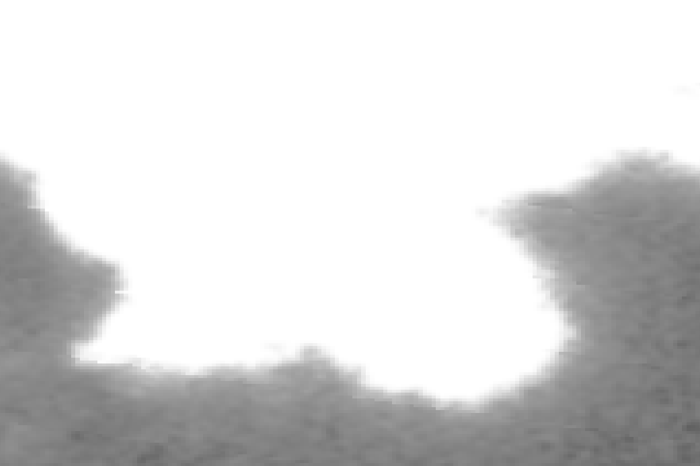 | 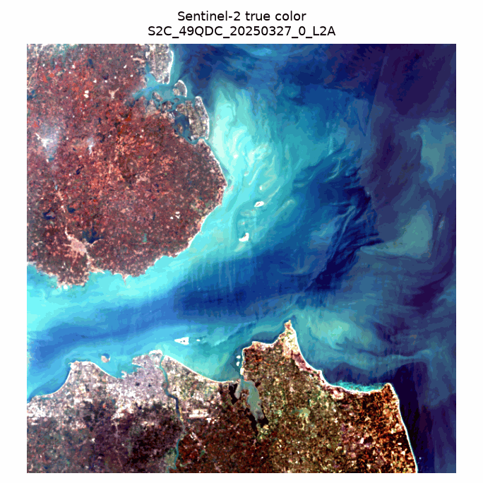 | 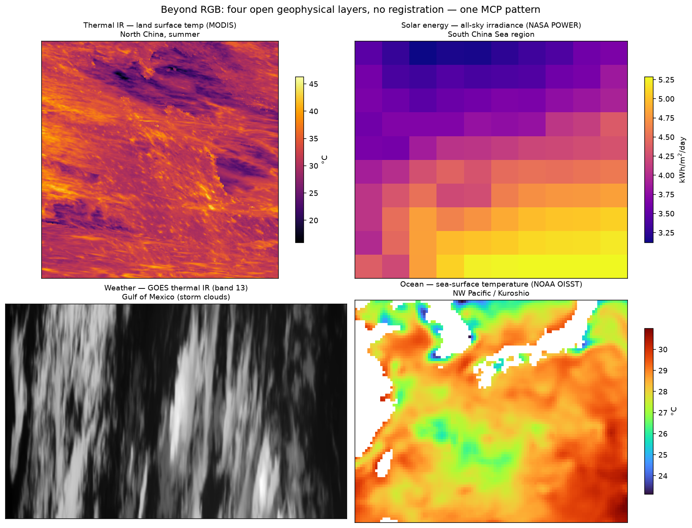 |

| Resolution Compare | SAR vs Optical | Terrain 3D |
| --- | --- | --- |
| 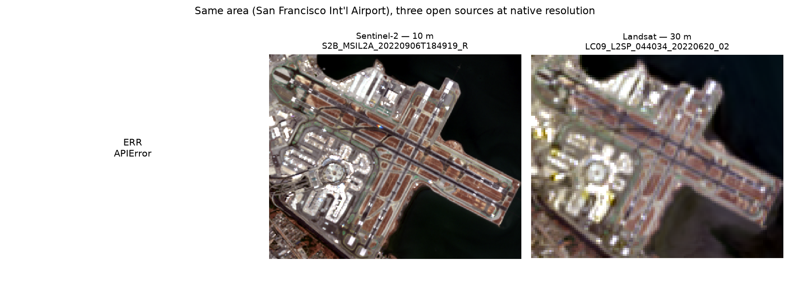 | 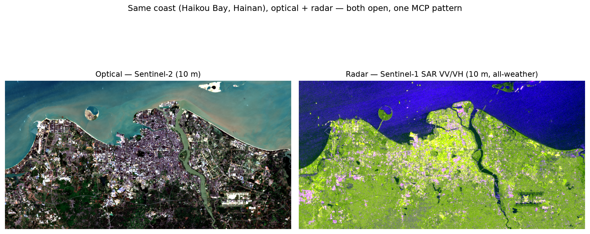 | 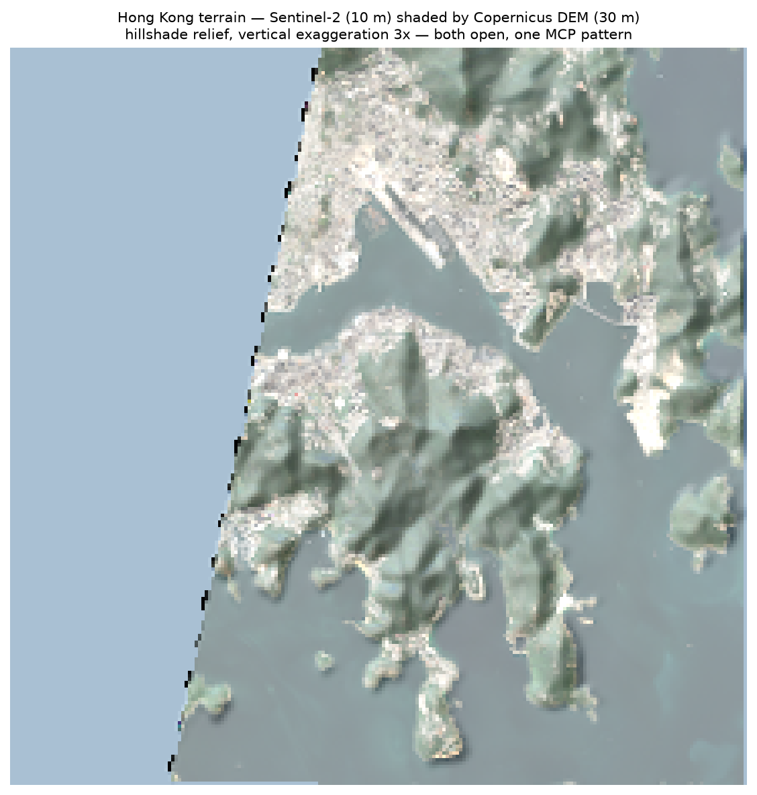 |

| Terrain 3D Views |
| --- |
| 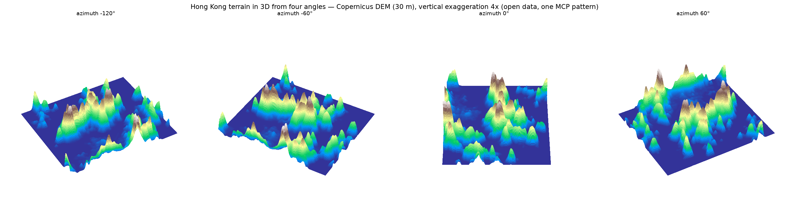 |

### Full Gallery Preview

| Desert Greening | Lop Nur Ponds | Hongjiannao Lake |
| --- | --- | --- |
| 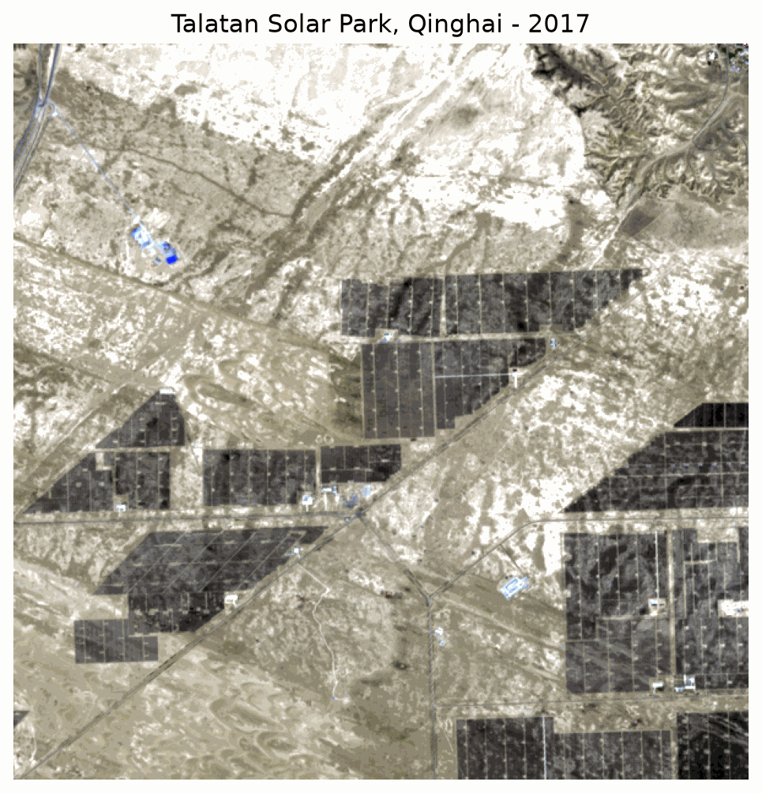 |  | 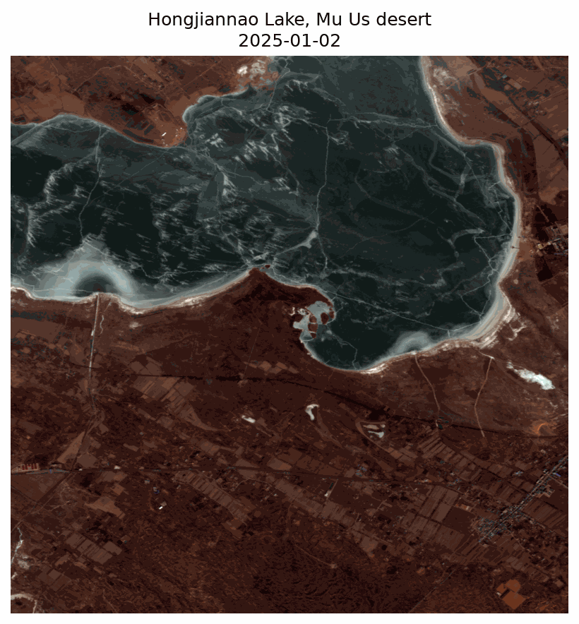 |

### Intermediate Figures Preview

| S2 RGB | S2 NDWI | S2 Water Mask |
| --- | --- | --- |
| 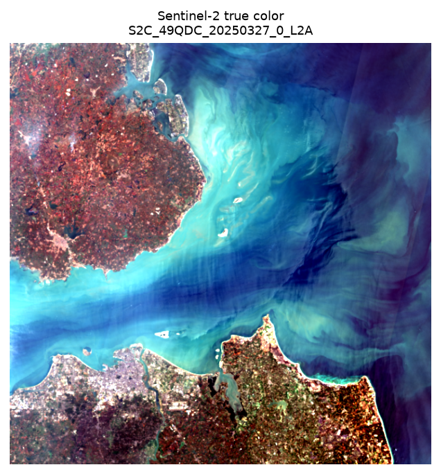 | 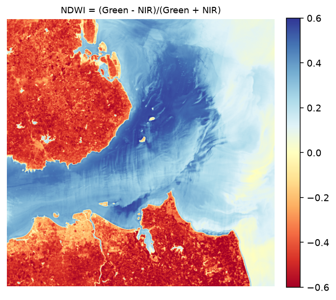 | 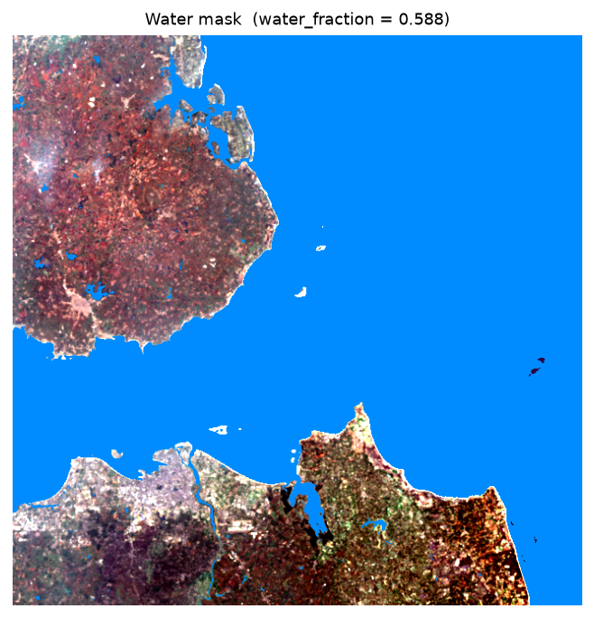 |

Original evidence lives in the recorded source metadata:

```text
generated/provenance/media_sources.json
```

That file records the queried URLs, STAC item IDs, WMS image URLs, and asset
links returned by the MCP-style source-discovery layer. The `media/` and
`figures/` folders contain generated or processed outputs created from those
sources.

## How This Connects To The MCP4RS Server

The main MCP4RS repo exposes source-discovery capabilities as MCP tools, such
as:

| MCP4RS tool concept | What it returns |
| --- | --- |
| `search_open_data` | Sentinel-2 STAC item IDs and asset URLs. |
| `search_catalog` | STAC item IDs and asset URLs across open catalogs. |
| `get_nightlights` | A NASA GIBS WMS image URL. |

This repo mirrors that source-discovery behavior in `source_queries.py` so the
media-gallery workflow can be tested independently in Colab, Codespaces, or a
small Hugging Face Space wrapper.

Later, `source_queries.py` can be replaced by live MCP client calls to the main
MCP4RS server. That would make this gallery a true extended function of the MCP
server instead of a standalone demonstration.

## Why This Looks Like An Agent Skill

The media gallery is closer to an Agent Skill than to the MCP core.

| Layer | Responsibility |
| --- | --- |
| MCP server | Finds open remote-sensing data and returns source URLs, STAC assets, or WMS URLs. |
| Media-gallery pipeline | Runs a multi-step workflow that records provenance and renders PNG/GIF outputs. |
| Future Agent Skill | Orchestrates MCP calls, runs the pipeline, validates outputs, and returns a gallery plus provenance. |

Future integration path:

```text
Agent Skill
  -> call MCP4RS tools
  -> save returned source metadata
  -> run render scripts
  -> produce media gallery + provenance report
  -> optionally expose the result inside the MCP4RS app
```

## Architecture

The architecture is written as Mermaid instead of a manually drawn PNG. This
keeps the diagram readable in GitHub and avoids overlapping labels.

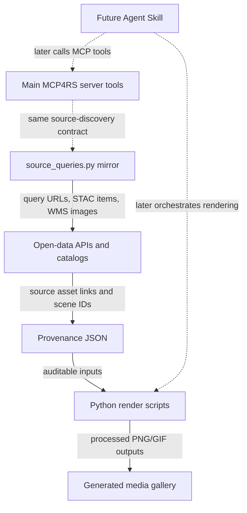

## Two Ways To Reproduce The Gallery

### 1. Google Colab

Open the notebook:

[MCP4RS_Reproducible_Media_Gallery_Demo.ipynb](notebooks/MCP4RS_Reproducible_Media_Gallery_Demo.ipynb)

After this repo is pushed to GitHub, the Colab URL will be:

```text
https://colab.research.google.com/github/MCP4RemoteSensing/mcp4rs-media-gallery/blob/main/notebooks/MCP4RS_Reproducible_Media_Gallery_Demo.ipynb
```

The notebook runs:

```bash
python scripts/export_media_sources.py
python scripts/generate_media_gallery.py --skip-long --continue-on-error
```

### 2. Codespaces Or Local Python

```bash
python -m pip install --upgrade pip
python -m pip install -r requirements.txt

python scripts/export_media_sources.py
python scripts/generate_media_gallery.py --skip-long --continue-on-error
```

For the full gallery, including longer lake/desert GIFs:

```bash
python scripts/generate_media_gallery.py --continue-on-error
```

## What The Hugging Face Space Shows

The included `app.py` is a lightweight Hugging Face Space wrapper around the
same reproducibility commands. It is not the MCP4RS app and it is not an MCP
server.

The Space will show:

| Space panel | What users see |
| --- | --- |
| Command Log | The exact export or generation command and its terminal output. |
| Source Provenance | Queried source metadata from `generated/provenance/media_sources.json`, including STAC item IDs, asset URLs, and WMS URLs. |
| Architecture Mermaid | The generated Mermaid architecture source. GitHub renders this as a diagram in the README. |
| Generated Media | Processed PNG/GIF outputs under `media/` plus intermediate static PNGs under `figures/`. |
| Generated Files | Downloadable media and provenance files from the run. |

For WMS cases such as nightlights, the source query returns a display-ready
image URL. For STAC cases such as Sentinel-2, NAIP, Landsat, Sentinel-1, and
Copernicus DEM, the source query usually returns asset URLs and scene IDs; the
render scripts then turn those assets into human-readable figures and GIFs.

## Source, Figures, And Processed Outputs

| Folder or file | Meaning | Commit policy |
| --- | --- | --- |
| `generated/provenance/*.json` | Source metadata and processing records, including URLs, scene IDs, asset links, and selected frames. | Normally generated-only; snapshot committed for this release and published to Hugging Face dataset. |
| `media/*.png`, `media/*.gif` | Final gallery outputs for README, Colab, and Hugging Face display. | Normally generated-only; snapshot committed for this release and published to Hugging Face dataset. |
| `figures/*.png` | Processed intermediate figures and frames used to assemble GIFs or inspect individual cases. | Normally generated-only; snapshot committed for this release and published to Hugging Face dataset. |
| `media/architecture.mmd` | Mermaid source for the architecture diagram. | Generated during a run; README also includes the Mermaid diagram. |

## Optional Logo Check Before Push

If you add a project logo, run this before pushing:

```bash
python scripts/check_logo.py --logo assets/logo.png
```

The check verifies that the logo is a readable raster image, large enough for
GitHub/Hugging Face display, not mostly transparent, and square-ish by default.
It also writes a visual preview to:

```text
generated/logo_preview.png
```

For a horizontal README banner instead of a square avatar-style logo, use:

```bash
python scripts/check_logo.py --logo assets/logo.png --allow-wide
```

## Generated Media

| Output | Source discovery | Rendering step |
| --- | --- | --- |
| `media/architecture.mmd` | No remote source; generated as Mermaid diagram source. | `scripts/generate_media_gallery.py` |
| `media/nightlights_prd.png` | NASA GIBS WMS `image_url`. | `source_queries.get_nightlights` download |
| `media/s2_workflow.gif` | Sentinel-2 asset URLs. | `render_scene.py` -> GIF |
| `media/desert_greening.gif` | Sentinel-2 time-series scenes. | `render_desert.py` -> GIF |
| `media/lopnur_ponds.gif` | Sentinel-2 time-series scenes. | `render_lake.py full lopnur` -> GIF |
| `media/hongjiannao_lake.gif` | Sentinel-2 time-series scenes. | `render_lake.py full hongjiannao` -> GIF |
| `media/physical_layers.png` | MODIS LST, GOES, OISST, NASA POWER. | `examples/physical_layers.py` |
| `media/resolution_compare.png` | NAIP, Sentinel-2, Landsat. | `examples/resolution_compare.py` |
| `media/sar_optical.png` | Sentinel-2 optical and Sentinel-1 SAR. | `examples/sar_demo.py` |
| `media/terrain_3d.png` | Sentinel-2 and Copernicus DEM. | `examples/terrain_3d.py` |
| `media/terrain_3d_views.png` | Copernicus DEM. | `examples/terrain_3d_views.py` |

## Repository Scope

This repo contains only the reproducibility pipeline for the media gallery.
Integration with the main MCP4RS app/server is intentionally left for the next
step.

The included `app.py` is optional and only exists so a Hugging Face Space can
run the same export/generate commands through buttons. It is not the MCP4RS app.
